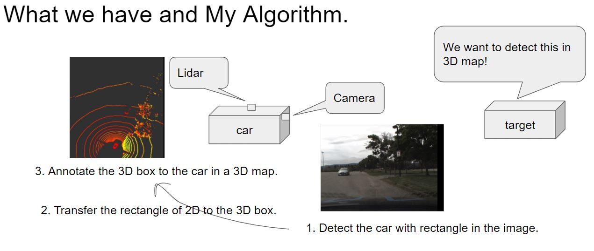

# Machine Learning Engineer Nanodegree
## Specializations
## Project: Capstone Proposal and Capstone Project

This is the summary of my documents, details are in [proposal](proposal.md) and [report](capstone_report.md)

## About my Trial of self-driving car system
In recent years, the demand for self-driving cars has increased. This requirement is because we believe that the self-driving cars can utilize the safety of society and efforts to improve productivity. For example, many people in Japan need to drive for living even if they are seniors in rural areas. Do not forget the fact that accidents are occurring due to deterioration of the judgment by aging. In such cases, self-driving cars can be utilized to prevent such unfortunate accidents in advance. Of course, this demand is not only Japan but worldwide. Also, for example, it is possible to use automated driving vehicles to reduce the labor load of long distance driving drivers and to suppress the number of public transportation personnel, which can lead to improvement of safety and productivity of society as a whole.
Such like that, the needs for self-driving cars exists everywhere.
Especially I am interested in the development of automatic driving cars because I can not drive a car with my paper license.
When auto-driven cars start to launch, my range of activities increases dramatically, and that degree of freedom also increases.
Also, although Japan has entered an aging society, it is necessary to prevent accidents of seniors in advance, and in anticipation of an increase in the demand for transportation methods accompanying such social changes, self-driving vehicles are revolutionary We believe we can demonstrate the effect.
And, if I can contribute to the development of that technology, I do not think there is any more honor.
And its development has been done actively.
For example, at [this movie](https://www.tesla.com/jp/autopilot), Tesla explains the automatic driving level 3 automatic driving technique.
This time, I recognize surrounding objects which are part of this automatic driving system.
However, on the other hand, it will be explained in detail later, but if you adopt a method that uses a submillimeter wave sensor like Lidar it will be expensive inevitably. Therefore, in my research, I estimate the position of the car on 3D photographed by Lidar, using only 2D camera images. This is the theme of my research.
This initiative also participated in [Didi Challenge Competition](https://challenge.udacity.com/team/#succcess-box) hosted by DiDi and Udacity and summarized my work.

## Method
In this study, we needed to reproject the position of the car found in 2D to the 3D map.
So I thought of an algorithm to estimate these from the car position on the 2D map.
To detect cars in the 2D, I use YOLOv2 and KittiBox to compare the prediction of them.
In the methodlogical story, the lateral direction uses the parallel orientation of the center position of the detected car region, and the depth direction uses the length of the area in the height direction of the detected vehicle region. These solution will show in the solution report.

## Results
These are the result of my prediction by YOLOv2, and the box in the 3D is following the car.
 * data : ford01  
  
 * data : ford02  
  
 * data : ford03  
  
