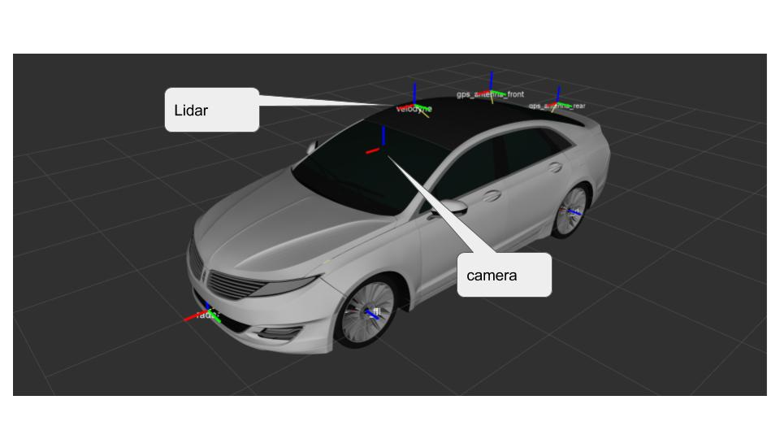
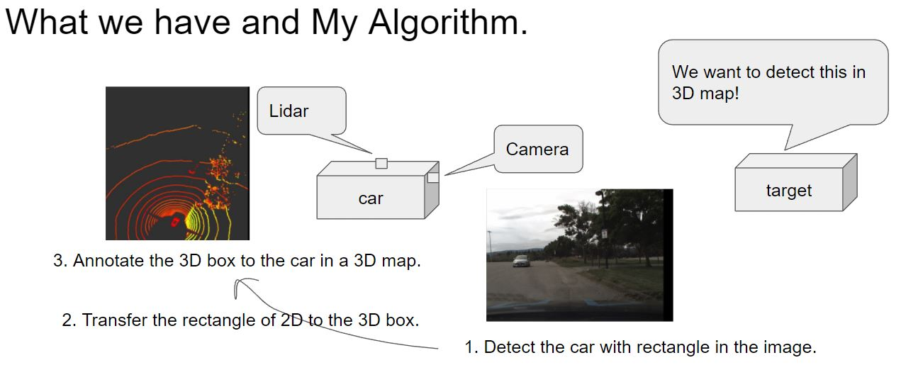
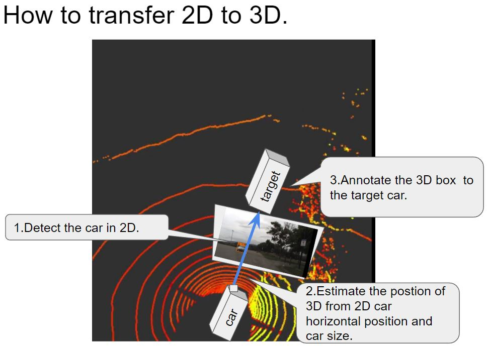
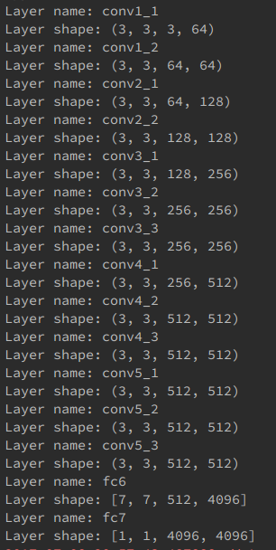
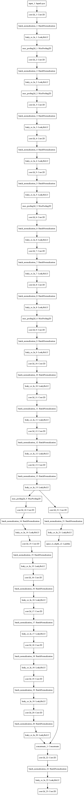
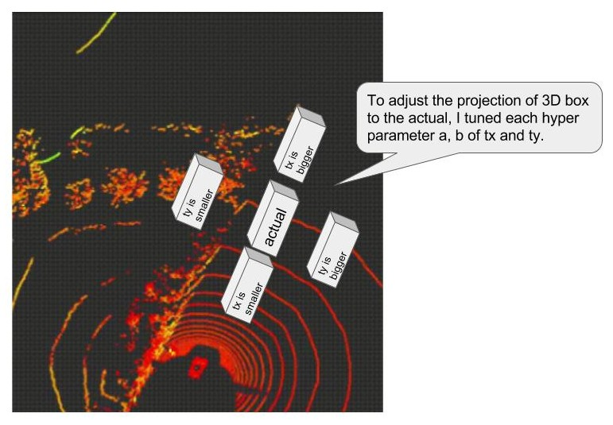
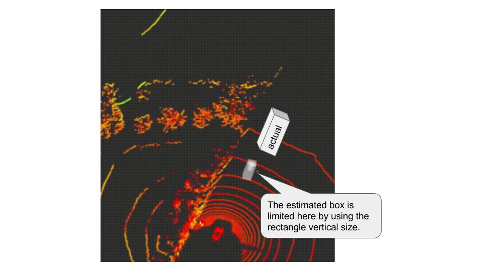

# Machine Learning Engineer Nanodegree
## Capstone Project
Keigo  
July 25th, 2017

## I. Definition

### Project Overview
#### Domain Background
In recent years, the demand for self-driving cars has increased. This requirement is because we believe that the self-driving cars can utilize the safety of society and efforts to improve productivity. For example, many people in Japan need to drive for living even if they are seniors in rural areas. Do not forget the fact that accidents are occurring due to deterioration of the judgment by aging. In such cases, self-driving cars can be utilized to prevent such unfortunate accidents in advance. Of course, this demand is not only Japan but worldwide. Also, for example, it is possible to use automated driving vehicles to reduce the labor load of long distance driving drivers and to suppress the number of public transportation personnel, which can lead to improvement of safety and productivity of society as a whole.
Such like that, the needs for self-driving cars exists everywhere.
Especially I am interested in the development of automatic driving cars because I can not drive a car with my paper license.
When auto-driven cars start to launch, my range of activities increases dramatically, and that degree of freedom also increases.
Also, although Japan has entered an aging society, it is necessary to prevent accidents of seniors in advance, and in anticipation of an increase in the demand for transportation methods accompanying such social changes, self-driving vehicles are revolutionary We believe we can demonstrate the effect.
And, if I can contribute to the development of that technology, I do not think there is any more honor.
And its development has been done actively.
For example, at [this movie](https://www.tesla.com/jp/autopilot), Tesla explains the automatic driving level 3 automatic driving technique.
This time, I recognize surrounding objects which are part of this automatic driving system.
However, on the other hand, it will be explained in detail later, but if you adopt a method that uses a submillimeter wave sensor like Lidar it will be expensive inevitably. Therefore, in my research, I estimate the position of the car on 3D photographed by Lidar, using only 2D camera images. This is the theme of my research.
This initiative also participated in [Didi Challenge Competition](https://challenge.udacity.com/team/#succcess-box) hosted by DiDi and Udacity and summarized my work.

#### Datasets and Inputs
The Organizer who is [Udacity and Didi](https://challenge.udacity.com/home/) provided data set of  [dataset1](http://academictorrents.com/details/76352487923a31d47a6029ddebf40d9265e770b5), [dataset2](http://academictorrents.com/details/18d7f6be647eb6d581f5ff61819a11b9c21769c7) for round 1 and [dataset](http://academictorrents.com/details/67528e562da46e93cbabb8a255c9a8989be3448e) for round 2. These datasets are from the actual car with driving. The data contains the image of the forward vision and PointCloud data by Lidar. Besides, including the position on the GPS of the subject vehicle and the surrounding object, but I did not use it in this effort.  
The camera and Lidar is installed to the car like below;  
  
[reference from here](https://github.com/udacity/didi-competition/blob/master/images/urdf.png)  
The camera can capture the image of forward vision, and it is just composed by RGB data, and size is 1400 * 512.
On the other hand, Lidar is like [this](http://velodynelidar.com/docs/datasheet/97-0038_Rev%20K_%20HDL-32E_Datasheet_Web.pdf). And Pointcloud data shows the objects captured by Lidar surroundings like [this](https://www.engadget.com/2016/01/04/nvidia-drive-px2/).
These data is zipped as a bag file which is based on [ROS](http://wiki.ros.org/) as known as open source robotic operating system.
The relationship of the datasets in this endeavor is that organizer acquired these datasets with the same car with camera and Lidar. In other words, information such as angle of view of the image does not change. I took this advantage in my efforts at this time.  
Below, I will post the video prepared as the data. This video captured by an in-vehicle camera and the whole of datasets are about 100Gbyte of such a moving picture.  
  
Also, in my efforts, I used [KittiBox](https://github.com/MarvinTeichmann/KittiBox)[1] and [YOLOv2](https://pjreddie.com/darknet/yolo/)[2] pretrained to detect vehicles and passers-by persons. KittiBox pretrained against cars, YOLOv2 is heard versatile for cars and passersby. I can use these model; it is because our data set assumed that the data set adapted for the general car and there is no significant difference from the object that our data set had.
We applied these learned models to the movie as above and identified the position of the car.  
[1] [MultiNet: Real-time Joint Semantic Reasoning for Autonomous Driving](https://arxiv.org/abs/1612.07695); Marvin Teichmann et al.  
[2] [YOLO9000: Better, Faster, Stronger](https://arxiv.org/abs/1612.08242); Joseph Redmon et al.

### Problem Statement

#### Problem Statement
The challenge this time is to understand and detect the objects around the vehicle. The sensor uses camera and Lidar. The goal is to identify the location of nearby cars and pedestrians on the 3D map from this information.
This trial uses 2D image data to find how cars are detected.
However, since there is no correct answer data, this may be a little qualitative evaluation, but I will make it possible to explain as quickness, etc.

### Metrics
This evaluation will discuss the consistency with the results already prepared for answers.
Specifically, the data is made up for testing, and it includes the car position on the 3D map. So it is possible to determine to what degree of correct answer rate in each model for the position information I will confirm and evaluate it.
The detected objects are scored based on the following idea.  
  [reference from here](https://github.com/udacity/didi-competition/tree/master/tracklets#metrics-and-scoring)  
The reason why this indicator is correct is that by accurately grasping the position of the target object on the 3D map with something like a 3D box, it is possible to know the relationship between the vehicle and the surroundings. It is because you can handle the steering wheel after understanding the situation properly.

## II. Analysis

### Data Exploration
So now I research the data of Datasets. Originally we got the dataset with .bag file, and the bag file contains some topics like below;
 * /cloud_nodelet/parameter_descriptions       1 msg     : dynamic_reconfigure/ConfigDescription : Internal data
 * /cloud_nodelet/parameter_updates            1 msg     : dynamic_reconfigure/Config : Internal data
 * /diagnostics                             1141 msgs    : diagnostic_msgs/DiagnosticArray       (3 connections) : Hardware information
 * /diagnostics_agg                          328 msgs    : diagnostic_msgs/DiagnosticArray       (2 connections) : Hardware information
 * /diagnostics_toplevel_state               328 msgs    : diagnostic_msgs/DiagnosticStatus      (2 connections) : Hardware information
 * /gps/fix                                 1275 msgs    : sensor_msgs/NavSatFix : gps position
 * /gps/rtkfix                              1639 msgs    : nav_msgs/Odometry : gps position
 * /gps/time                                1559 msgs    : sensor_msgs/TimeReference : gps time to harmonize each gpses
 * /image_raw                               4917 msgs    : sensor_msgs/Image : image from the camera
 * /obs1/gps/fix                             292 msgs    : sensor_msgs/NavSatFix : gps position
 * /obs1/gps/rtkfix                         1634 msgs    : nav_msgs/Odometry : gps position
 * /obs1/gps/time                           1144 msgs    : sensor_msgs/TimeReference : gps time to harmonize each gpses
 * /radar/points                            3277 msgs    : sensor_msgs/PointCloud2 : PointCloud data
 * /radar/range                             3277 msgs    : sensor_msgs/Range : PointCloud data
 * /radar/tracks                            3278 msgs    : radar_driver/RadarTracks : PointCloud data
 * /rosout                                    15 msgs    : rosgraph_msgs/Log                     (7 connections) : ROS log
 * /tf                                     16267 msgs    : tf2_msgs/TFMessage : Transform
 * /velodyne_nodelet_manager/bond            656 msgs    : bond/Status                           (3 connections) : PointCloud data
 * /velodyne_packets                        1638 msgs    : velodyne_msgs/VelodyneScan : PointCloud data
 * /velodyne_points                         1638 msgs    : sensor_msgs/PointCloud2 : PointCloud data
These are the ROS data format of topics. These topics are changing in the each frame. In this project, I decided to use only the /image_raw to estimate the position of car, and project it to the 3D Lidar data of velodyne_points.

### Exploratory Visualization
Let me show you the visualized data with gif animation, image_raw and pointcloud data.  
 * camera image view  
  
 * PointCloud view  
  

### Algorithms and Techniques
Also, in this study, we needed to reproject the position of the car found in 2D to the 3D map.
So I thought of an algorithm to estimate these from the car position on the 2D map.
To detect cars in the 2D, I use YOLOv2 and KittiBox to compare the prediction of them.
In the methodlogical story, the lateral direction uses the parallel orientation of the center position of the detected car region, and the depth direction uses the length of the area in the height direction of the detected vehicle region. These solution will show in the solution report.

### Benchmark
Here, I will compare the two method of KittiBox and YOLOv2 in the 2D image to evaluate the prediction of the car.
 * KittiBox  
  
 * YOLOv2  
  

## III. Methodology

### Implementation
My codes are consist of the files below;  
 * pipeline.py : main code of processing pipeline
 * ImageProcessUtils.py : Utilities of Image processing e.g. Change the image color space, size, apply threshold, and draw boxes.
 * generate_tracklet.py : generate result xml file
#### About pipeline.py
In this file, I implemented the pipeline of the main process of my trial, the abstruct of the pipeline is below;  
1. load the image.
2. apply detection to the image, and get rectangle of the object area of car.
3. transfer it to the 3D map.  
Let me show the details.  

* About "load the image."  
        images = sorted(glob.glob(os.path.join(path, .jpg)), key=numericalSort)
        for fname in images:
                # if using kittibox
                image = mpimg.imread(fname)
                # if using YOLOv2
                image = Image.open(fname)

Here is the just only load the image, but the data type of image is not same depends on the library. So, I change how to load the image with matplotlib and PIL.

 * About "apply detection to the image, and get rectangle of the object area of car."  
        # if using kittibox
        output, bbox = pl.pipeline_kb(image)
        # if using YOLOv2
        output, bbox = pl.pipeline_yolov2(image)
The argment is the image object and return is annotated image as output, and rectangle of the car position as bbox. Additionally each function is below;  

        # Main pipeline process of this project
        def pipeline_kb(self, img):
          # convert dtype for uint8 for processing
          img = img.astype(np.uint8)

          # apply kittibox
          out_img, pred_boxes = self.annotate.make_annotate(img, threshold=0.5)

          # stitch windows to centeroid and filter out false positive with heatmap
          heatmap = np.zeros_like(img[:, :, 0])
          heat = self.ipu.add_heat(heatmap, pred_boxes)

          self.ipu.apply_threshold(heat, 100000, 3)
          labels = label(heatmap)
          draw_img = self.ipu.draw_labeled_bboxes(img, labels)

          bbox = self.ipu.get_labeled_bboxes(labels)

          out_img = draw_img
          return out_img, bbox
In this kittibox call function, stiich the rectangle to one in the same car using heatmap voted method.  

        # Main pipeline process of this project
        def pipeline_yolov2(self, img):

          # apply YOLOv2
          out_img, pred_boxes, pred_classes, pred_scores = self.annotate.make_annotate(img, threshold=0.5)

          # get the highest prediction scored rectangle
          max_s = float("-inf")
          bbox = []
          for b, c, s in zip(pred_boxes, pred_classes, pred_scores):
            if c == self.target:
              if s > max_s:
                bbox = [[[b[1], b[0]], [b[3], b[2]]]]
                max_s = s

          return out_img, bbox
In this YOLOv2 call function, if there are some rectangle, it neglect the lower scored rectangles, using only highest scored rectangle.

* About "transfer it to the 3D map."  

      def estimate_obstacle_car(bbox):
        bbox = bbox[0]
        # center of the rectangle
        cx = abs((bbox[1][0] + bbox[0][0]) / 2)
        cy = abs((bbox[1][1] + bbox[0][1]) / 2)

        # size of the rectangle
        dx = abs((bbox[1][0] - bbox[0][0]))
        dy = abs((bbox[1][1] - bbox[0][1]))

        # tx, ty and tz are the positions of car in the 3D, x is depth, y is horizontal position and z is vertical position.

        # This equation is from the measurement result of car size and 3D position.
        # tx:dy = 28.7 : 75.9 = 4 : 320
        a = (4 - 28.7) / (320 - 75.9)
        a += -a / 1.5
        b = 28.7 - a * 75.9 - 12 # + is far, - is closer
        tx = a * dy + b

        # This equation is from the measurement result of car size and 3D position.
        # ty:cx = 0.2 : 680 = 3.6 : 1293
        a = (0.2 - 3.6) / (680. - 1293)
        a += a / 3.7
        b = 3.6 - a * 680 # + is right, - is left
        ty = a * cx + b
        ty = -ty + 3.0

        # This equation is from the measurement result of car size and 3D position and based on the hypothesis of z is constant while running on the plane.
        tz = -0.85
        return tx, ty, tz

#### About model
In each library, the DNN is using and the model layer consist of below;  
 * KittiBox  

* YOLOv2

### Refinement
First, I use kittibox, however the accuracy of detection is not good. So, I change the framework to the YOLOv2.
* KittiBox  
  
* YOLOv2  
  
Additionally, I tuned the hyper parameters of a and b in the tx and ty for each. This parameters are the projection parameters from 2D to 3D. The projection changes like below;  

## IV. Results
### Model Evaluation, Validation and Justification
These are the result of my prediction by YOLOv2, and the box in the 3D is following the car.
 * data : ford01  
  
 * data : ford02  
  
 * data : ford03  
  

### Some Discussion
 * Is the model robust enough for the problem?  
This model is robust for this problem, if the image predictier detect the car, it would be nice to annotate on the 3D map. This is because my algorithm consist on the static calculation by linear equation from 2D to 3D.

 * Can results found from the model be trusted?
 In the image, the result looks like trusty, however, in the 3D map it is not perfect trastable. This is because my transform algorithm is not well done about image processing and transformation. This issue will discuss in the Improvement.

 * Is the final model reasonable and aligning with solution expectations?
Yes, it is. The detection of car in the 3D map from 2D picture seems like good. The annotation in the 3D map is not worse. But the hole accuracy is not good because of my lack of knowledge about ROS and PCL. So in the next time I will improve it to hack with them.

## V. Conclusion

### Reflection
In my trial, I use the method of only using 2D picture to estimate the 3D position. This result depends on the prediction of the cars from image so I use the pre-trained model to shortcut. This strategy looks good for me and I can focus on the estimate function from 2D rectangle to 3D box with reasonable precision. About interesting aspects, there are the depth limit of my projection function like below;  
  
I think this is because my estimated model is not good for this problem, but I study a little of optimal theory of perspective it is the fine idea for using the linear equation. So, I think this occurs by using only the image of 2D camera.

### Improvement
In the next situation, I will consider below;  
 * In this trial, I did not consider about image distortion so the result is not well captured in the side of image.
 * At a position far from my car the estimater does not clearly detect the object position. This occurs by the limitation of transfer equation is just using the linear function.
 * To improve accuracy it should also consider with the PCL data.
 * To improve projection, we need to use the transformation matrix from camera view to PCL.
