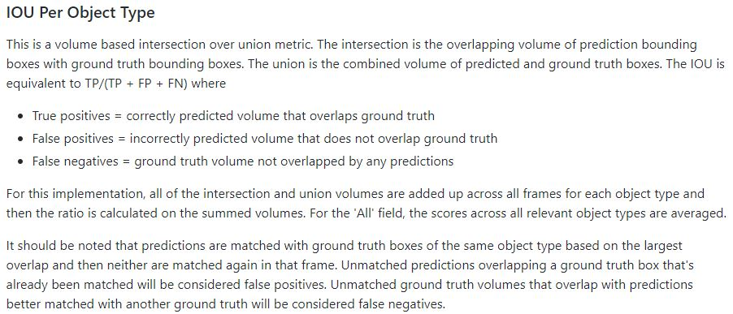

# Machine Learning Engineer Nanodegree
## Capstone Proposal
Keigo Takahashi  
July 5th, 2017

## Proposal

### Domain Background
Development of automated driving vehicles has been actively carried out in recent years.
For example, in [this movie](https://www.tesla.com/jp/autopilot), Tesla explains the automatic driving technique of automatic driving Level 3.
In my efforts this time, we will recognize surrounding objects that are part of this automatic driving system.  
Also, this initiative is a result of participating in [Didi challenge competition](https://challenge.udacity.com/team/#success-box) that I organized by DiDi and Udacity and summarizing the results we worked.

### Problem Statement
The challenge this time is to understand and detect the objects around the vehicle. The sensor uses camera and Lidar. The goal is to identify the location of nearby cars and pedestrians on the 3D map from this information. The detected objects are scored based on the following idea.

### Datasets and Inputs
The organizer provided this dataset was. These data sets are obtained from the data of the actual driving of the car. The data contains the image of the forward vision, PointCloud data by Lidar. Besides, the position on the GPS of the subject vehicle and the surrounding object is included, but it was not used in this effort.  
The relationship with the problem of the data set this time is that it is acquired by the same car and camera, Lidar for own vehicle. In other words, information such as angle of view of the image does not change. I took advantage of this in my efforts this time.  
Also, in my efforts this time, I used [KittiBox](https://github.com/MarvinTeichmann/KittiBox)[1] and [YOLOv2](https://pjreddie.com/darknet/yolo/)[2] which I have already learned to detect vehicles and passers-by persons. KittiBox is learned against cars, YOLOv 2 is heard versatile for cars and passersby. It is assumed that the data set adopted for the current test was acquired by a general car and there is no significant difference from the object that can be detected by the learned model, which is a prerequisite I will.  
[1] [MultiNet: Real-time Joint Semantic Reasoning for Autonomous Driving](https://arxiv.org/abs/1612.07695); Marvin Teichmann et al.  
[2] [YOLO9000: Better, Faster, Stronger](https://arxiv.org/abs/1612.08242); Joseph Redmon et al.

### Solution Statement
Also, in this study, we needed to project the position of the car found in 2D to the position of the car on the 3D map.
So I thought of an algorithm to estimate these from the car position on the 2D map.
Specifically, the lateral direction uses the parallel orientation of the center position of the detected car region, and the depth direction uses the length of the area in the height direction of the detected vehicle region.

### Benchmark Model
In this study, we compare Kittibox and YOLOv 2 first.
The benchmark model is Kittibox, and compare the results of YOLOv 2 with that.
Then, based on the result, decide an appropriate model and describe the effect when reflecting those models on the 3D map.

### Evaluation Metrics
This evaluation will discuss the consistency with the results already prepared for answers.
Specifically, it is made for testing as a data set, and by using data whose answers are known on the 3D map, it is possible to determine to what degree of correct answer rate in each model for the position information I will confirm and evaluate it.
The evaluation index is as described in the Problem Statement above.

### Project Design
As a rough flow, we will first compare Kittibox and YOLOv 2 to the same image data and compare the differences.
This uses 2D image data to find how much cars are being detected.
However, since there is no correct answer data, this may be a little qualitative evaluation, but I will make it possible to explain as quickly as possible using animation, etc.
Next, we project them onto PointCloud data on 3D map and compare them.
Since quantitative data of score should be able to be calculated here, we will examine it also by using movies, etc. while utilizing it.
I will discuss regarding how much they correspond to the actual 3D position, and how much support is available for blurred data in 3D.
Also, I will not discuss too much about the model difference, but in general it is a prospect that YOLOv 2 will be better. Since it comes from precision and real-time pre-confirmation information, we will keep it to the extent that it is confirmed by experiments just in case of this examination.
The theme of this study is how to project 3D information only with 2D information, for example, Lidar is very expensive as equipment and thinks that the risk of failure is high because it is a complicated mechanism.
So, if we can estimate the 3D position only from the camera image, we think that it is useful both economically and maintenance.
Even if it is impossible to detect the surrounding objects from the camera image alone perfectly, if it is possible to recognize to some extent, the performance of the Lidar will be degraded, or in the event of a failure it will be possible to perform automatic operation with only the camera, such as fail-safe I think that we can also help.
So, we believe that if this technology is established the possibility of more automatic operation will increase.
In that sense, in this project, I would like to confirm that I can only use 2D camera images and how far I can go.