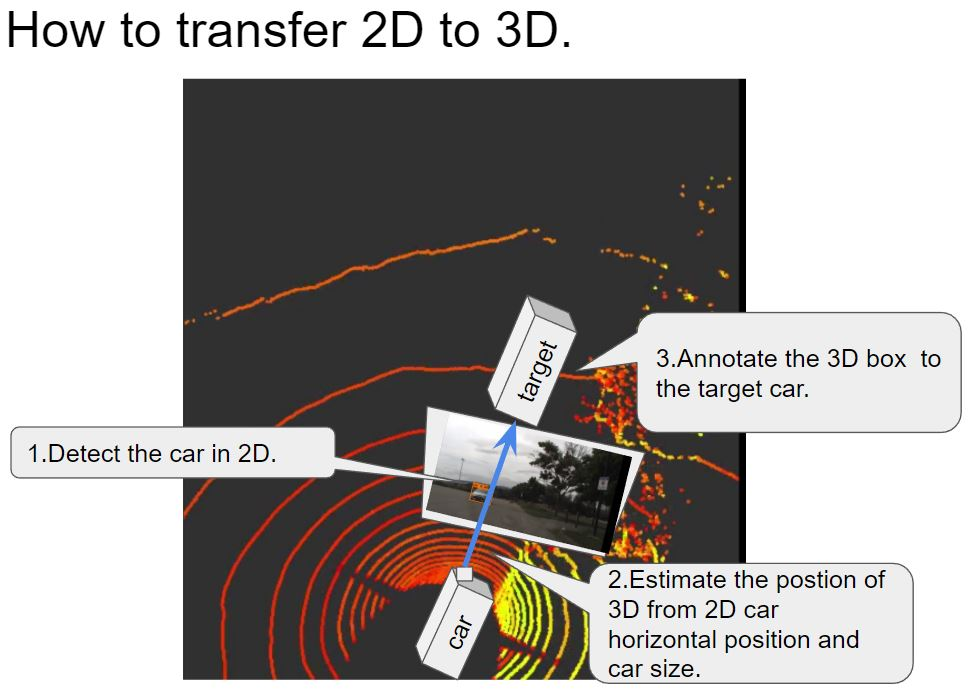

# Machine Learning Engineer Nanodegree
## Capstone Proposal
Keigo  
July 19th, 2017

## Proposal

### Domain Background
In recent years, the demand for self-driving cars has increased. This requirement is because we believe that the self-driving cars can utilize the safety of society and efforts to improve productivity. For example, many people in Japan need to drive for living even if they are seniors in rural areas. Do not forget the fact that accidents are occurring due to deterioration of the judgment by aging. In such cases, self-driving cars can be utilized to prevent such unfortunate accidents in advance. Of course, this demand is not only Japan but worldwide. Also, for example, it is possible to use automated driving vehicles to reduce the labor load of long distance driving drivers and to suppress the number of public transportation personnel, which can lead to improvement of safety and productivity of society as a whole.
Such like that, the needs for self-driving cars exists everywhere.
Especially I am interested in the development of automatic driving cars because I can not drive a car with my paper license.
When auto-driven cars start to launch, my range of activities increases dramatically, and that degree of freedom also increases.
Also, although Japan has entered an aging society, it is necessary to prevent accidents of seniors in advance, and in anticipation of an increase in the demand for transportation methods accompanying such social changes, self-driving vehicles are revolutionary We believe we can demonstrate the effect.
And, if I can contribute to the development of that technology, I do not think there is any more honor.
And its development has been done actively.
For example, at [this movie](https://www.tesla.com/jp/autopilot), Tesla explains the automatic driving level 3 automatic driving technique.
This time, I recognize surrounding objects which are part of this automatic driving system.
However, on the other hand, it will be explained in detail later, but if you adopt a method that uses a submillimeter wave sensor like Lidar it will be expensive inevitably. Therefore, in my research, I estimate the position of the car on 3D photographed by Lidar, using only 2D camera images. This is the theme of my research.
This initiative also participated in [Didi Challenge Competition](https://challenge.udacity.com/team/#succcess-box) hosted by DiDi and Udacity and summarized my work.

### Problem Statement
The challenge this time is to understand and detect the objects around the vehicle. The sensor uses camera and Lidar. The goal is to identify the location of nearby cars and pedestrians on the 3D map from this information.
This trial uses 2D image data to find how cars are detected.
However, since there is no correct answer data, this may be a little qualitative evaluation, but I will make it possible to explain as quickness, etc.

### Datasets and Inputs
The Organizer who is [Udacity and Didi](https://challenge.udacity.com/home/) provided data set of  [dataset1](http://academictorrents.com/details/76352487923a31d47a6029ddebf40d9265e770b5), [dataset2](http://academictorrents.com/details/18d7f6be647eb6d581f5ff61819a11b9c21769c7) for round 1 and [dataset](http://academictorrents.com/details/67528e562da46e93cbabb8a255c9a8989be3448e) for round 2. These datasets are from the actual car with driving. The data contains the image of the forward vision and PointCloud data by Lidar. Besides, including the position on the GPS of the subject vehicle and the surrounding object, but I did not use it in this effort.  
The camera and Lidar is installed to the car like below;  
  
[reference from here](https://github.com/udacity/didi-competition/blob/master/images/urdf.png)  
The camera can capture the image of forward vision, and it is just composed by RGB data, and size is 1400 * 512.
On the other hand, Lidar is like [this](http://velodynelidar.com/docs/datasheet/97-0038_Rev%20K_%20HDL-32E_Datasheet_Web.pdf). And Pointcloud data shows the objects captured by Lidar surroundings like [this](https://www.engadget.com/2016/01/04/nvidia-drive-px2/).
These data is zipped as a bag file which is based on [ROS](http://wiki.ros.org/) as known as open source robotic operating system.
The relationship of the datasets in this endeavor is that organizer acquired these datasets with the same car with camera and Lidar. In other words, information such as angle of view of the image does not change. I took this advantage in my efforts at this time.  
Below, I will post the video prepared as the data. This video captured by an in-vehicle camera and the whole of datasets are about 100Gbyte of such a moving picture.  
  
Also, in my efforts, I used [KittiBox](https://github.com/MarvinTeichmann/KittiBox)[1] and [YOLOv2](https://pjreddie.com/darknet/yolo/)[2] pretrained to detect vehicles and passers-by persons. KittiBox pretrained against cars, YOLOv2 is heard versatile for cars and passersby. I can use these model; it is because our data set assumed that the data set adapted for the general car and there is no significant difference from the object that our data set had.
We applied these learned models to the movie as above and identified the position of the car.  
[1] [MultiNet: Real-time Joint Semantic Reasoning for Autonomous Driving](https://arxiv.org/abs/1612.07695); Marvin Teichmann et al.  
[2] [YOLO9000: Better, Faster, Stronger](https://arxiv.org/abs/1612.08242); Joseph Redmon et al.

### Solution Statement
Also, in this study, we needed to reproject the position of the car found in 2D to the 3D map.
So I thought of an algorithm to estimate these from the car position on the 2D map.
To detect cars in the 2D, I use YOLOv2 and KittiBox to compare the prediction of them.
In the methodlogical story, the lateral direction uses the parallel orientation of the center position of the detected car region, and the depth direction uses the length of the area in the height direction of the detected vehicle region. These solution will show in the solution report.

### Benchmark Model
I did not plan to use benchmark model, because there is no trial for this idea.
However, in this study, I will compare Kittibox and YOLOv 2 first.
Then, based on the result, decide an appropriate model and describe the effect when reflecting those models on the 3D map.
Also, the composition of DNN of each model is not described here because the purpose is different. Please check each thesis.

### Evaluation Metrics
This evaluation will discuss the consistency with the results already prepared for answers.
Specifically, the data is made up for testing, and it includes the car position on the 3D map. So it is possible to determine to what degree of correct answer rate in each model for the position information I will confirm and evaluate it.
The detected objects are scored based on the following idea.  
  [reference from here](https://github.com/udacity/didi-competition/tree/master/tracklets#metrics-and-scoring)  
The reason why this indicator is correct is that by accurately grasping the position of the target object on the 3D map with something like a 3D box, it is possible to know the relationship between the vehicle and the surroundings. It is because you can handle the steering wheel after understanding the situation properly.

### Project Design
As a rough flow, we will first compare Kittibox and YOLOv 2 to the same image data and compare the differences.
Next, we project them onto PointCloud data on 3D map and compare them.
Since quantitative data of score should be able to be calculated here, we will examine it also by using movies, etc. while utilizing it.
I will discuss regarding how much they correspond to the actual 3D position, and how much support is available for blurred data in 3D.
Also, I will not discuss too much about the model difference, but in general it is a prospect that YOLOv 2 will be better. Since it comes from precision and real-time pre-confirmation information, we will keep it to the extent that the experiments confirm just in case of this examination.
The theme of this study is how to project 3D information only with 2D information, because, for example, Lidar is very expensive as equipment and thinks that the risk of failure is high because it is a complicated mechanism.
So, if we can estimate the 3D position only from the camera image, we think that it is useful both economically and maintenance.
Even if it is impossible to detect the surrounding objects from the camera image alone perfectly or if it is possible to recognize to some extent, it will occur the degrade to the performance of the Lidar. In the event of a failure, it will be possible to perform the automatic operation with only the camera, such as fail-safe I think that we can also help.
So, we believe that if this technology launch, the possibility of more automatic operation will increase.
In that sense, in this project, I would like to confirm that I can only use 2D camera images and how far I can go.
