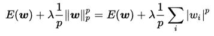
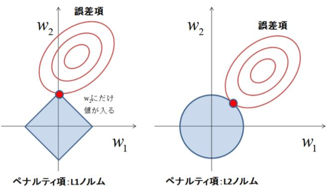

**Question1**  
We A/B tested two styles for a sign-up button on our company's product page. 100 visitors viewed page A, out of which 20 clicked on the button; whereas 70 visitors viewed page B, and only 15 of them clicked on the button. Can you confidently say that page A is a better choice or page B? Why?  

**Answer**  
In the case of A/B test, we need to compare the result of the both cases and take the better one from that results.
So we will check the click ratio of the both page A and page B. Let me show that below.  
A: 20 / 100 = 0.20  
B: 15 / 70 = 0.214  
This result shows that page A is clicked 50% by the users and page B is clicked 21.4%.  
However I will check this with A/B testing below;
Probability of pool = (20 + 15) / (100 + 70) = 0.206  
Standard Error of pool = sqrt(0.206 * (1 - 0.206) * (1/100 + 1/70)) = 0.0630  
d = 15/70 - 20/100 = 0.014  
m = SEpool * 1.96 = 0.123  

|d - m|d + m|
|---:|---:|
|-0.109|0.137|  

Finally, we can get the range of confidence. If we set the practical significant level as 0.02, this range include it. So there is no difference in the both page with statistics.

---
**Question2**  
Can you devise a scheme to group Twitter users by looking only at their tweets? No demographic, geographic or other identifying information is available to you, just the messages they’ve posted, in plain text, and a timestamp for each message.

In JSON format, they look like this:  
{  
 "user_id": 3,  
 "timestamp": "2016-03-22_11-31-20",  
 "tweet": "It's #dinner-time!"  
}  
Assuming you have a stream of these tweets coming in, describe the process of collecting and analyzing them, what transformations/algorithms you would apply, how you would train and test your model, and present the results.  

**Answer**  
We have three features in each record, and we should categorize their property by timestamp and tweet. Let me break down the devises.
* About feature of "tweet."  
For example, if there are some words of about children, he has a child, or if there are some computer science words, he is an engineer or students, and so on.  
If we classify based on the above concept, I would like to prepare the following analysis and algorithm.The analysis checks the words of each tweet, and summarize them.
For example, if the tweet is "Hi, I did my machine-learning analysis with SVM!", we will take each word like "Hi", "I", "did" and so on, and find "machine-learning" or "SVM", and then label this tweet as a by checking which term most including, like two computer science words.  
After that, we can get the tagged tweet, and feed them into classifier model like above.  
I will consider NLP content of tweets as another idea.
It is also an idea to divide the speech content into categories as described above, but it is interesting to see how the content of a particular tweet propagates to multiple people.
For example, if one person got a topic of cats, it collects data on how others will be affected and how they propagate.
It collects topics about cats of one group in chronological order.
Then model its propagation degree.
For example, it may be better to use RNN, LSTM, etc. specialized in time series.
Learn them so that the spread of actual topics of cats can be reproduced.
For example, the input is the contents of all tweets in the group, and the output is the degree of propagation, for instance, the number of topics of cats.
If I can learn it, I use it to predict the topic of a dog.
With the contents of the tweet as input, we predict how widely the dog's theme is spreading and how far it will spread from the propagation degree of the output.
Of course, it is necessary to verify whether the range level model is the same, but it is also possible to create a model that learns the propagation degree of the topic using tweets.

* About feature of "timestamp."  
Also, if you can use the timestamp value, you can do the following things.
Using the timestamp, we can classify their mainly active time in Twitter.
For instance, if the tweet is usually in the evening, we can assume him as a student and so on.
The other example if the tweet is typically in the early morning, we can imagine him as a market staff and so on.  
If we classify based on the above concept, I would like to prepare the following analysis and algorithm.  
The analysis is to collect the each person's data and make the histogram with the timestamp; the bin size is for example 3 hours to get the most common tweet time because we do not need to consider about the exact time of the tweet to know which time he is active.  
After that, I will make it as a summary label of timestamp data, and "user_id" and that labeled timestamp data compose the dataset of each training and testing data.
Of course, it is suitable that dataset with shuffled and split to the training and testing.
If we need to know the active time for each person, I will feed this feature to my model.
The model is like a classifier, for example, SVM or something like that to classify.

---
**Question3**  
In a classification setting, given a dataset of labeled examples and a machine learning model you're trying to fit, describe a strategy to detect and prevent overfitting.

**Answer**  
To detect and prevent overfitting, I will take the strategy below;
 * Random choice to split the train and test data.  
If the dataset is biased by selection, it occurs the overfit for each data. So, it is a good way to pick up randomly from the whole dataset to prevent overfitting.
 * Shuffle the data of training.  
If the data has a relation in its order, it occurs overfitting by the orders. So, we need to shuffle the data to share the orders which cause overfitting.
 * Stop the training when testing error value becomes up.  
When the overfitting happens, the testing error value becomes higher than the previous epoch, and the training error becomes lower. This phenomenon means the model fits for the training dataset and not to be suitable for test dataset.So it is nice to stop the training when this happens.
 * Add some noise to the training data to generalize the model  
This strategy is not usual method, but especially in the case of Image Classification, sometimes use this method to avoid overfitting with less number of the dataset. To do this, adding some white noise to the image, rotating image or zooming image, and so on. Doing this, we can produce the infinite variations, so in the training phase, the model can learn more from the different information by the limited data.
 * Evaluate model with cross validation
To prevent overfitting, we can use cross-validation method.
In particular, the k - fold cross - validation divides the data into k pieces, learning it with k - 1 of them.
And we will test with the remaining one.
This combination is done for all k pieces of data, and the average value is taken as the score of the model.
The number used for testing is not 1, it can be more than that.
Of course, it is smaller than k.
This method is used for quantitatively evaluating the overfitting of model learning results due to partial data bias.
 * Parameter tuning
 Tuning hyperparameters in some model e.g. decision tree are essential. In the decision tree model, there is hyperparameter of depth.
 This depth is the depth of the tree.
 So if the depth is deeper than the shallow model, the model tends to be overfitting, because it is like the smaller bin size to collect data.

---
**Question4**  
Your team is designing the next generation user experience for your flagship 3D modeling tool. Specifically, you have been tasked with implementing a quick context menu that learns from a modeler’s usage of menu options and shows the ones that would be most beneficial. For instance, I often use Edit > Surface > Smooth Surface and wish I could just right click and there would be a Smooth Surface option just like Cut, Copy and Paste. Note that not all commands make sense in all contexts, for instance, I need to have a surface selected to smooth it. How would you go about designing a learning system/agent to enable this behavior?

**Answer**  
idea1
To do that, I will cluster the actions to our modeling system.
Thus, it comes to the same actions by the user; we can present the user action by our clustered actions.

idea2
Using reinforcement learning is the better way to do this. The actor acts as a user of modeling system, by using clicks or mouse move or something do like a user. Then the model learns the behavior of dialogs. For example, if you want to learn work that wants to make something smooth, and if you can do the work quickly, give it a reward. By constructing such a system, agents let us learn the operation of our modeling system and learn what kind of operation is most efficient. Then, by presenting the result to the actual user, it becomes possible to present it to the user by using the learning result without defining the efficient and effective operation in all cases by the developer.

idea3
First, I will make the abstracted model of user control flow, for instance, in the 3D modeling tool, the user will repeat these works;
1. select the object.  
2. choose the operation to the object.  

I think this is the main flow to the model. Of course, adding a new 3D model is also included in this. In that case, for example, you select a line and draw a line in 3D space. And it also involves the operation to the environmental settings. In that case, the object is the environment, and the operation is the change of setting and to what.

Second, our system will collect the user work of the relation of each step, for example, a user takes the smooth operation to some meshes, then my system gets the data like;
1. meshes.  
2. apply smooth operation.  

These data are the training data of our support system, and our system accumulates this information and learns a series of what kind of action does the users frequently do when the users choose the object.
In the learning, the training is based on the supervised learning to predict the operation. The input of the model is an object, and output prediction is the operation type which most likely to do for that object. So in the training phase, we feed the data of object and operation.

Finally, our model has trained, we can display that prediction in the right click menu to improve the user experience. And this series of the flow is not once, but continuous learning by the user work. Additionally, it is not the same for the each user so
to be able to change the learned model for each user.

---
**Question5**  
Give an example of a situation where regularization is necessary for learning a good model. How about one where regularization doesn't make sense?

**Answer**  
In general, if the model is complicated, we need to use regularization to make the model sparse. The regularization works as a penalty to the remarkable change of the parameters. For instance, when the training time is too long, or the training data is out of common data, we need to apply regularization to the model. The regularization equation is below.  
  
[wikipedia](https://ja.wikipedia.org/wiki/%E6%AD%A3%E5%89%87%E5%8C%96)

In general, we can consider two regularization parameters, L1 and L2.  
About L1 regularization, we can make some features as zero with using L1. This theory means we select the features from the hole like a sparse model. However we need to pay attention to the data, it should be normalized with mean=0, diviation=1, because in the L1 regularization, it reduces lambda in each data of hole features, so it needs the same scaling with each feature. Also, L1 regularization model is called as a Lasso.  
About L2 regularization, we can make a smooth model with using L2. Also, L2 regularization model is called as a Ridge.
These two regularization's theory is like a bound of parameters to train.

[link](http://tjo.hatenablog.com/entry/2015/03/03/190000)

 On the other hand, the model is in the underfitting to the dataset, and there is no reason to use the regularization. In that case, we should collect the data to deepen the learning or apply more epochs to the learning.

---
**Question6**  
Your neighborhood grocery store would like to give targeted coupons to its customers, ones that are likely to be useful to them. Given that you can access the purchase history of each customer and catalog of store items, how would you design a system that suggests which coupons they should be given? Can you measure how well the system is performing?

**Answer**  
First, I will check the statistic metrics of the whole purchase data with the personal properties. And then look for the data corresponds or the deviations. To perform customer segmentation, we collect data on who bought what. In particular, we collect data based on the viewpoint of what category of products was combined and purchased.

Second, I will make some unsupervised models, like a KMeans clustering to predict what kind of purchase is going to do by the customer with each products category. To do that feed the data of each purchase with what he bought to make the clustering. Of course, if there are many categories of products, we can use PCA to reduce features.

Finally, we can make customer data clustered, so we will send the coupon which is in the same cluster. However, we need to evaluate the system by return ratio of the coupon. If the coupon meets the customer needs, then the usage of the coupon increases. So we should check the frequency of the coupons, and check the statistic metrics for each item. For example, if we send the most of the raw meat, but the user did not use the coupon, we need to reconsider its distribution destination.

---
**Question7**  
If you were hired for your machine learning position starting today, how do you see your role evolving over the next year? What are your long-term career goals, and how does this position help you achieve them?

**Answer**  
If I can be in the machine learning position, I will assist the business with the prediction by using the machine learning. This style is the most attractive area for me to enroll as a machine learning engineer. The data can react the world of business to measurable world. And the machine learning is the powerful weapon for it to accelerate the business decisions. In the above question, I did show how to make a system of machine learning and how to show the useable predictions with real world's data. Also, this is what I learned in this Nanodegree.  
In the long term career, I would like to be a business consultant whose base is on the machine learning engineer. So I would like to handle the real world's real-time data and help more business in the world.
